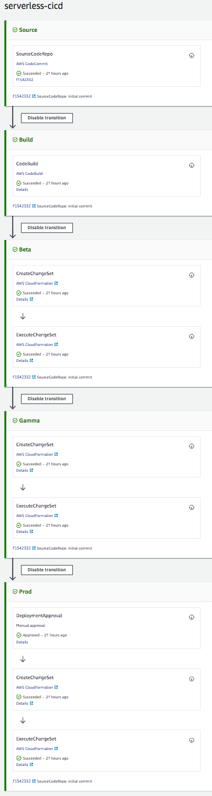

# serverless-cicd-pipeline
 
This Serverless application creates a generic 3-environment CI/CD pipeline for Serverless apps written in Python 3.6 that use SAM (Serverless Application Model).

It's based on the [cookiecutter-aws-sam-python](https://github.com/aws-samples/cookiecutter-aws-sam-python) works.



## TO DEPLOY WITH AWS SAM AND
```
sam package --template-file template.yaml \
  --output-template-file packaged.yaml \
  --s3-bucket <<<YOUR BUCKET NAME>>>

aws cloudformation deploy \
  --template-file packaged.yaml \
  --stack-name <<<YOUR STACK NAME>>> \
  --parameter-overrides ProjectName=<<<YOUR PROJECT NAME>>> \
  --capabilities CAPABILITY_IAM
```

## Deploy from the AWS Serverless Application Repository
* Hit "Deploy" from the [application](https://serverlessrepo.aws.amazon.com/#/applications/arn:aws:serverlessrepo:eu-central-1:689573718314:applications~serverless-cicd-pipeline) page


## License

Apache License 2.0 (Apache-2.0)

Made with ❤️ by Christian Mueller. Available on the [AWS Serverless Application Repository](https://aws.amazon.com/serverless)